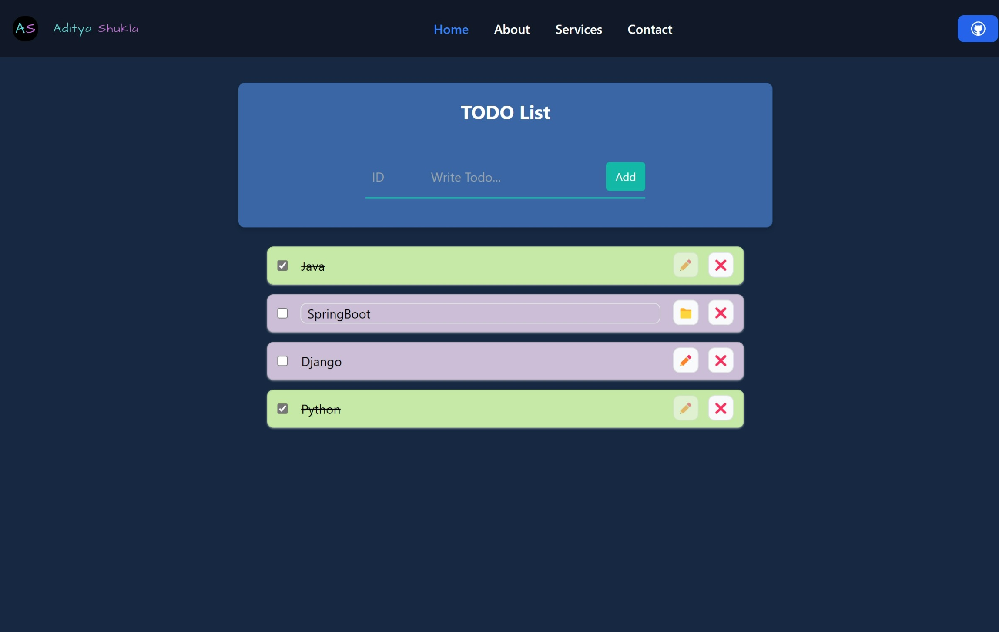

<div align="center">
<h1 align="center">React & Spring Boot To-Do List</h1>
      
  <br />

  <!-- <div>
    
  </div> -->
</div>

## 📋 <a name="table">Table of Contents</a>

1. 🤖 [Introduction](#introduction)
2. ⚙️ [Tech Stack](#tech-stack)
3. 🔋 [Features](#features)
4. 🤸 [Quick Start](#quick-start)
5. 🕸️ [Snippets](#snippets)

## <a name="introduction">🤖 Introduction</a>

The React & Spring Boot To-Do List application allows users to add, remove, and mark tasks as completed. This full-stack application is built with a React frontend using Vite and Tailwind CSS, and a Spring Boot backend with RESTful API endpoints for managing tasks. The frontend uses `axios` for API requests to interact with the backend.

## <a name="tech-stack">⚙️ Tech Stack</a>

**Backend**
- Spring Boot
- Spring Web
- Spring Data JPA
- MySQL Driver

**Frontend** 
- React.js
- Vite
- Tailwind CSS
- `axios`


## <a name="features">🌟 Features</a>

👉 **Task Addition/Removal**: Users can add new tasks or remove tasks from the list.

👉 **Dynamic Display**: Tasks are dynamically displayed on the UI.

👉 **Marking as Completed**: Tasks can be marked as completed and will be visually distinguished.

👉 **API Integration**: Full CRUD operations are supported via REST API.

## <a name="quick-start">🤸 Quick Start</a>

### Prerequisites

Make sure you have the following installed on your machine:

- Git
- Node.js
- npm (Node Package Manager)
- Java JDK 8 or higher
- MySQL


### Backend Setup

**Cloning the Repository**

```bash
git remote add origin https://github.com/Aditya10403/Todo.git
cd Todo
```

**Configuring MySQL Database**

- Create a new MySQL database.
- Update the `application.properties` file located in the `src/main/resources` directory with your database credentials.

```properties
spring.datasource.url=jdbc:mysql://localhost:3306/database_name
spring.datasource.username=user_name
spring.datasource.password=user_password
spring.jpa.hibernate.ddl-auto=update
```

**Running the Backend**

```bash
./mvnw spring-boot:run
```

### Frontend Setup

**Install Dependencies and Start the Frontend Server**

```bash
cd ../client
npm i
npm run dev
```

Open your browser and navigate to `http://localhost:5173` for vite users.

**How to Use**

👉 **Adding a Task**: 
- Enter a task in the input field and press the `Add` button.
- The task will appear in the list below.

👉 **Marking a Task as Completed**: 
- Click on the checkbox next to a task to mark it as completed.
- The task will be visually indicated as completed.

👉 **Removing a Task**: 
- Click on the ❌ button next to a task to remove it from the list.

👉 **Updating a Task**: 
- Click on the ✏️ button next to a task to edit it.
- The task's text will be loaded into the input field for editing.
- Modify the text and press the 📁 button again to save the changes.


## <a name="snippets">🕸️ Snippets</a>

<details>
<summary><code>application.yml</code></summary>

```yml
spring:
  application:
    name: Todo_api

  jpa:
    hibernate:
      ddl-auto: update
    show-sql: true

  datasource:
    url:  jdbc:mysql://localhost:3306/database_name
    username: user_name
    password: user_password
    driver-class-name: com.mysql.cj.jdbc.Driver

server:
  port: 8085 # configure port

```

</details>

<details>
<summary><code>vite.config.js</code></summary>

```javascript
import { defineConfig } from "vite";
import react from "@vitejs/plugin-react";

// https://vitejs.dev/config/
export default defineConfig({
  server: {
    proxy: {
      "/api": {
        target: "http://localhost:8085",
        secure: false,
      },
    },
  },
  plugins: [react()],
});

```

</details>

<details>
<summary><code>tailwind.config.js</code></summary>

```javascript
/** @type {import('tailwindcss').Config} */
export default {
  content: [
    "./index.html",
    "./src/**/*.{js,ts,jsx,tsx}",
  ],
  theme: {
    extend: {},
  },
  plugins: [],
}
```

</details>


## <a>🚨 Disclaimer</a>

The ToDo List implemented here is intended for educational purposes only.

#

